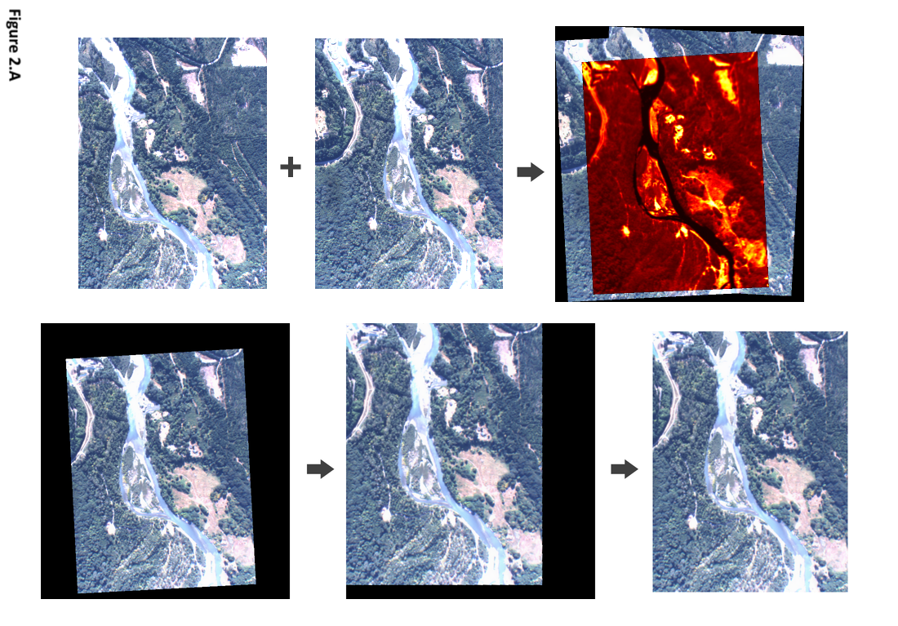
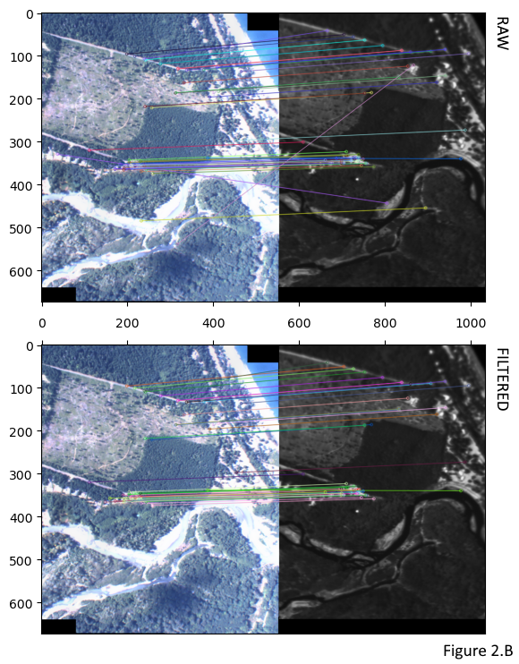

# Dataset Realignment Discussion

## Problem Description

The purpose of this project is to prepare RGB and IR images taken of the Elwah river in 2012 for more advanced CV processing like cold water refuge mapping. The dataset is made up of photos taken by an IR camera and an RGB camera. As such, the RGB images and IR images do not align. There is an additional quirk adding complexity: the RGB images overlap amongst themselves, as do the IR images. For more information, see the book introduction.

 

 | 
:-------------------------:|:-------------------------:
IR overlayed on RGB demonstrating offset | IR images projected onto RGB stitch

 

## Approach Utilized

The reconstruction of the dataset begins by stitching together RGB images via feature detection, like a panorama. In this specific case, the images are labelled 1 through 406, and it turned out that IR image `x` overlaps with RGB images `x` and `x-1`.

Then, the next step was to estimate the homography for projecting each IR image onto its RGB stitch image. This homography is used to project a mask of the same dimensions as the IR image onto a background of the same dimensions as the RGB stitch. This mask is then composited over the RGB stitch and used to crop it, after which the final step is to use the reverse of the previously estimated homography to project the cropped RGB stitch back to rectangular form (of the same dimensions as the IR image)!

 

 | 
:-------------------------:|:-------------------------:
Visualization of the entire project workflow | Before and after effect of quadrant filtering

 

The homography estimation function provided by openCV can run RANSAC, however this proved not to be enough to deal with outliers. Luckily, we know information about the dataset that can help filter out outlier matches before we pass them to our homography estimator!

Generally, the IR image should align with the stitched RGB images very well with just a little distortion, as the misalignment factor is low enough such that even simply pasting it on top gets it close to aligned. Therefore, we can assign ever keypoint to a quadrant relative to the center of the image. If a keypoint and its matched keypoint are in different quadrants (in their respective images) then they are likely an outlier, and we can discard that match.

## Problems Encountered

`TODO: elaborate on the below issues`

* determining when to throw out a homography
* RANSAC not being enough
* limiting to first 50 matches

## Alternative Approaches

The vast majority of existing approaches in matching cross-modal images seem to rely on neural networks and other computationally intensive techniques that require large datasets. These approaches come at the tradeoff of being harder to train and being less suitable for smaller datasets, but likely have the benefit of lower (or no) dataset loss, if trained properly.

Another approach that was in fact originally part of the plan for this book is to skip the homography all together and to just paste the IR images onto the RGB stitches directly, using keypoints for some minor resizing and to estimate where to paste. For this specific dataset the technique resulted in worse quality reconstructions particularly in the first 1/4 of the dataset, when the plane is turning, but the pros of the solution are that it is vastly simpler and less succeptible to homography projection issues.

## Next Steps

There are two main tasks that remain for this project. The first, as spelled out in the introduction, is to make use of this aligned dataset for further processing, such as the cold water refuge mapping it was originally intended for.

The second area of work is in improving the dataset realignment process. There may be further ways to improve the matching of images, which would lead to both lower dataset loss and better quality reconstructions.